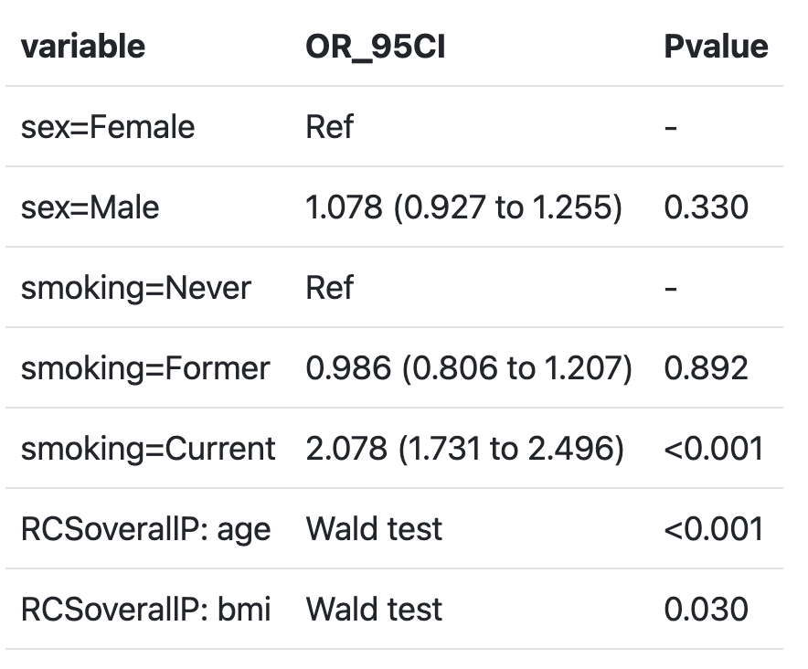
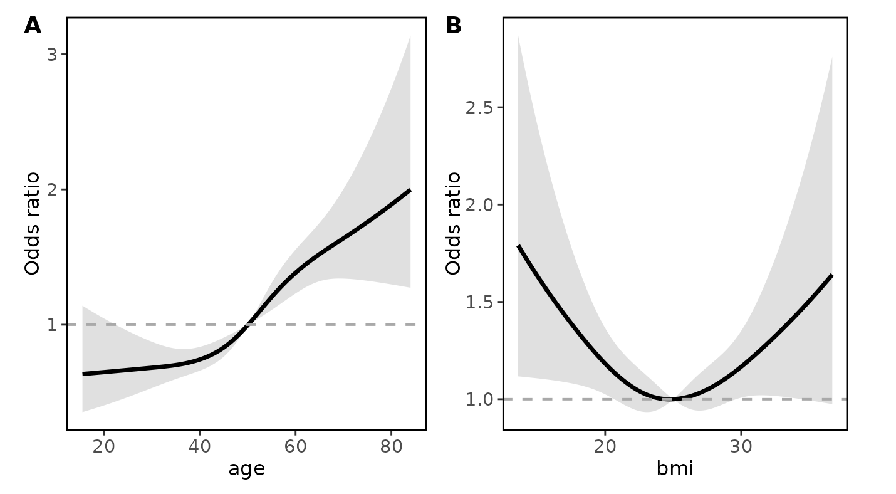
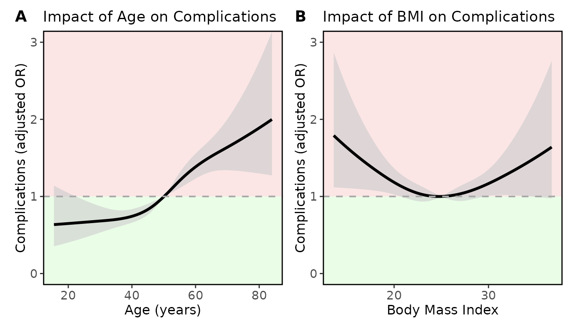

[](https://cran.r-project.org/package=rmsMD)
[](https://cran.r-project.org/package=rmsMD)
[](https://cran.r-project.org/package=rmsMD)


rmsMD 
==============================

**rmsMD** provides streamlined functions for summarising and visualising regression models fitted with the [`rms`](https://cran.r-project.org/package=rms) package, in the preferred format for medical journal reporting. 

It includes support for linear, logistic, and Cox models, handles restricted cubic splines (RCS) automatically, and produces publication-ready tables and plots.


---

## Installation

You can install `rmsMD` from CRAN:

```r
install.packages("rmsMD")
```

It is recommended that this package is used alognside `rms`, which can be installed via:

```r
install.packages("rms")
```

---

## Quick start

### Fit regression models and create clean outputs
Fit a logistic regression model with restricted cubic splines for age and BMI.  
Generate a publication-ready summary table from the fitted model.
```r
library(rmsMD)
library(rms)

# Fit an OLS model including a restricted cubic spline 
# for Age and BMI (with 4 knots)
fit_lrm <- lrm(majorcomplication ~ rcs(age,4) + 
                 rcs(bmi,4) + 
                 sex + 
                 smoking, 
               data = data)

# Generate a publication-ready summary table
modelsummary_rms(fit_lrm)
```



---

### Building basic plots
Create basic plots of the model’s restricted cubic spline terms to visualize adjusted effects.

```r
# Most basic output
ggrmsMD(fit_lrm, data)
```



---

### Plot customisation
Customize axis labels, plot titles, and shading to highlight inferior outcomes visually.
```r
# x axis labels can be stored in a list
xlabels <- list ("age" = "Age (years)",
                 "bmi" = "Body Mass Index")

# titles for each variable can be stored in a list
titles <- list ("age" = "Impact of Age on Complications",
                 "bmi" = "Impact of BMI on Complications")

ggrmsMD(fit_lrm, data,
        # set y axis label for all plots
        ylab = "Complications (adjusted OR)", 
        # set y axis limits
        ylim = c(0,3),
        # set higher OR as inferior outcome to assign red shading
        shade_inferior = "higher", 
        # set x axis labels for each variable
        xlabs = xlabels, 
        # set titles for each variable
        titles = titles 
        )
```



---

## Learn more

See the [Standard workflow with restricted cubic splines vignette](articles/Standard_workflow_with_restricted_cubic_splines.html) for a full worked example.
